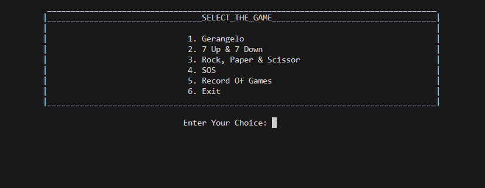

# Game Dome  🎮
This repository contains C++ programs implementing four simple games using object-oriented programming principles.
## Games Included

1. **Gerangelo**
   - The Gerangelo presents players with a scrambled word to guess within three attempts. 
   - It features three levels easy, medium, and hard each offering progressively more challenging word scrambles.
   -  Players must unscramble the word correctly within their limited guesses.          
2. **SOS Game**
   - The goal is to form the sequence "SOS" either horizontally, vertically, or diagonally. 
   - Each time a player successfully forms "SOS," they earn a point. 
   - The game continues until all cells on the grid are filled.  

3. **7 Up 7 Down Game**
   - In the 7 Up 7 Down game, players guess whether the sum of two dice rolls will be higher than 7.
   - After making a guess, the dice are rolled behind the scenes. 
   - If the player's prediction is correct, they win the round. 

4. **Rock Paper Scissors Game**
   - A players choose between rock, paper, or scissors.
   - Following are the rules:
    -  Rock beats scissors
    -  scissors beats paper
    - paper beats rock 
    - if same then tie

## Requirements

- C++ compiler 

## How to Use

1. **Clone the Repository:**
   - git clone https://github.com/FatimaShamas/Game-Dome.git

